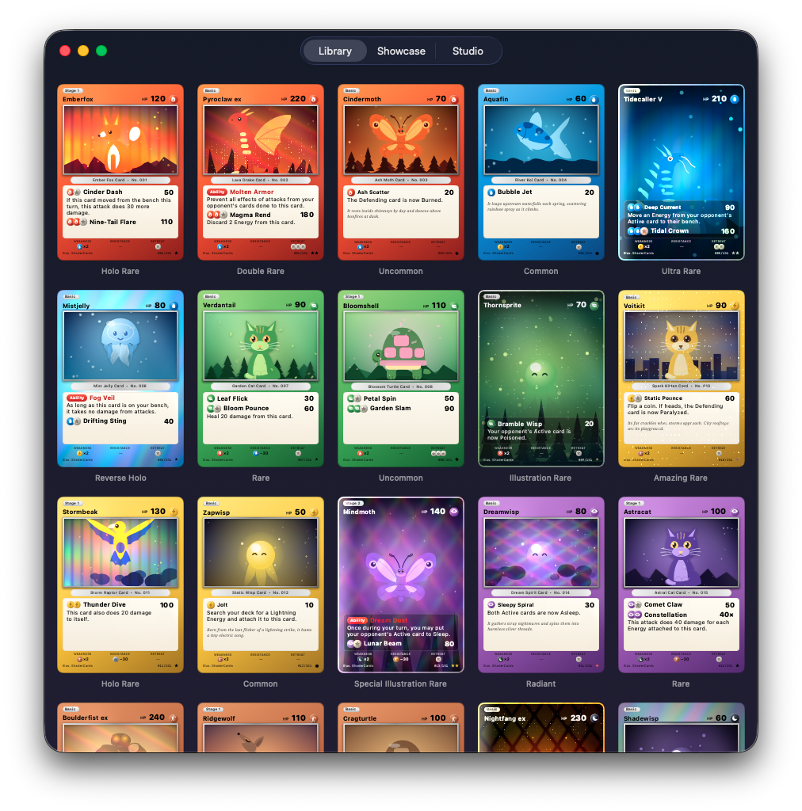
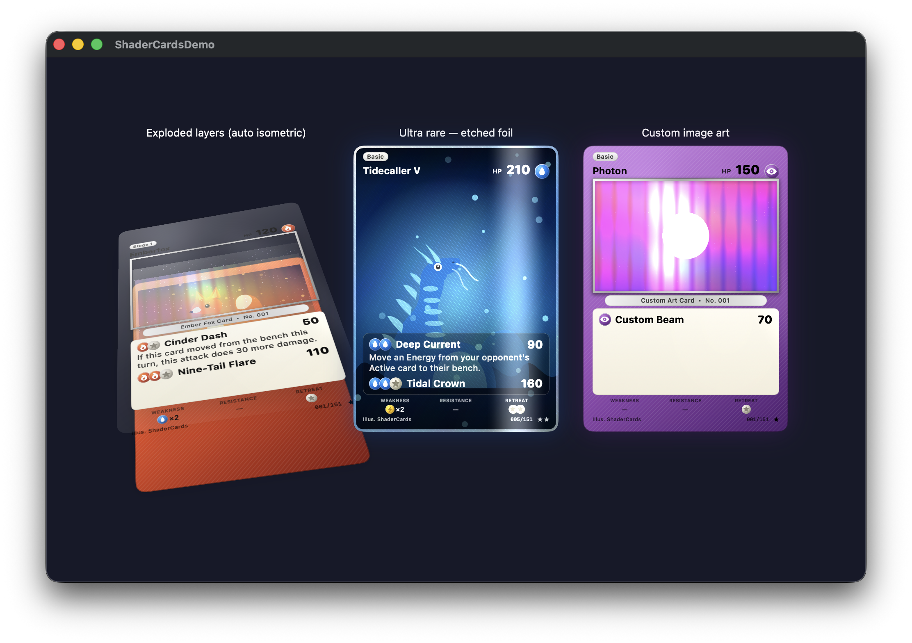
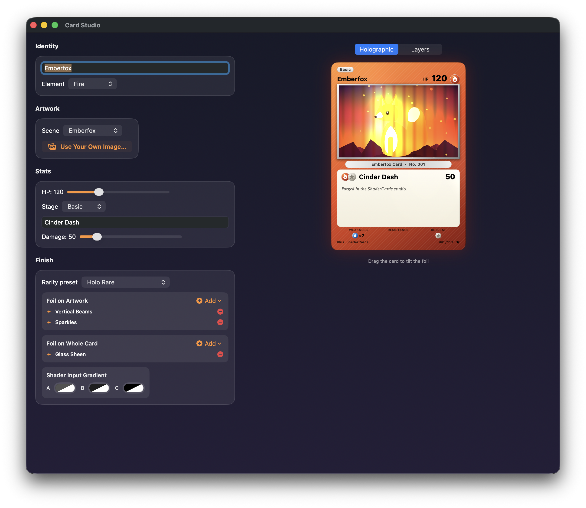

# ShaderKit

<a href="https://buymeacoffee.com/jamesrochabrun">
  
</a>

A Swift package for composable Metal shaders and holographic UI effects in SwiftUI.

[](https://swift.org)
[](https://developer.apple.com)
[](https://developer.apple.com)

# Demos:


https://github.com/user-attachments/assets/6f813c40-f022-4874-ad97-d83cda51747f

## Quick Start

Create holographic cards with composable shader effects:

```swift
import ShaderKit

HolographicCardContainer(width: 260, height: 380) {
    CardContent()
        .foil()
        .glitter()
        .lightSweep()
}
```

The `HolographicCardContainer` provides:
- Device motion tracking via gyroscope
- Drag gesture for manual tilt control
- 3D rotation effects synchronized with tilt
- Dynamic shadow based on tilt angle
- Automatic shader context injection

## Installation

### Swift Package Manager

Add ShaderKit to your project via Xcode:

1. File → Add Package Dependencies
2. Enter the repository URL
3. Select your version requirements

Or add to your `Package.swift`:

```swift
dependencies: [
    .package(url: "https://github.com/jamesrochabrun/ShaderKit.git", from: "1.0.0")
]
```

The package ships three library products — depend only on what you need:

- **ShaderKit** — the composable Metal shader primitives and holographic containers
- **ShaderKitUI** — ready-made interactive components (jelly switch, jelly button)
- **ShaderCards** — Pokémon-style holographic trading cards built on ShaderKit (see [ShaderCards](#shadercards))

## Available Shaders

ShaderKit provides 52 composable shader effects, including holographic,
glass, metallic, material, seasonal, paper, and interactive 3D treatments.

### Foil Effects

| Effect | Description | Parameters |
|--------|-------------|------------|
| `.foil()` | Rainbow foil overlay | `intensity: Double = 1.0` |
| `.invertedFoil()` | Inverted foil with shine | `intensity: Double = 0.7` |
| `.maskedFoil()` | Foil with masked area | `imageWindow: SIMD4<Float>, intensity: Double = 1.0` |
| `.foilTexture()` | Fine diagonal line texture | `imageWindow: SIMD4<Float>` |

### Glitter & Sparkle

| Effect | Description | Parameters |
|--------|-------------|------------|
| `.glitter()` | Sparkle particle overlay | `density: Double = 50` |
| `.multiGlitter()` | Multi-scale sparkle particles | `density: Double = 80` |
| `.sparkles()` | Tilt-activated sparkle grid | - |
| `.maskedSparkle()` | Sparkles in masked area only | `imageWindow: SIMD4<Float>` |
| `.rainbowGlitter()` | Rainbow with luminosity blend | `intensity: Double = 0.7` |
| `.shimmer()` | Metallic shimmer effect | `intensity: Double = 0.7` |

### Light Effects

| Effect | Description | Parameters |
|--------|-------------|------------|
| `.lightSweep()` | Sweeping light band | - |
| `.radialSweep()` | Rotating radial light sweep | - |
| `.angledSweep()` | Angled light sweep | - |
| `.glare()` | Following light hotspot | `intensity: Double = 1.0` |
| `.simpleGlare()` | Simple radial glare | `intensity: Double = 0.7` |
| `.edgeShine()` | Edge highlight effect | - |

### Holographic Patterns

| Effect | Description | Parameters |
|--------|-------------|------------|
| `.diamondGrid()` | Diamond grid pattern | `intensity: Double = 1.0` |
| `.intenseBling()` | Maximum intensity diamond holo | - |
| `.starburst()` | Radial rainbow rays from center | `intensity: Double = 1.0` |
| `.blendedHolo()` | Luminance-blended rainbow | `intensity: Float = 0.7, saturation: Float = 0.75` |
| `.verticalBeams()` | Vertical rainbow beam pattern | `intensity: Double = 0.7` |
| `.diagonalHolo()` | Diagonal lines with 3D depth | `intensity: Double = 0.7` |
| `.crisscrossHolo()` | Criss-cross diamond pattern | `intensity: Double = 0.7` |
| `.galaxyHolo()` | Galaxy/cosmos with rainbow overlay | `intensity: Double = 0.7` |
| `.radialStar()` | Star pattern with radial fade | `intensity: Double = 0.7` |
| `.subtleGradient()` | Large-scale subtle gradient | `intensity: Double = 0.7` |
| `.metallicCrosshatch()` | Metallic sun-pillar with crosshatch | `intensity: Double = 0.7` |
| `.spiralRings()` | Concentric spiral rings with metallic effect | `intensity: Double = 0.8, ringCount: Double = 20, spiralTwist: Double = 0.5` |

### Glass Effects

| Effect | Description | Parameters |
|--------|-------------|------------|
| `.glassEnclosure()` | Plastic/glass layer with beveled edges | `intensity: Double = 1.0, cornerRadius: Double = 0.05, bevelSize: Double = 0.7, glossiness: Double = 0.8` |
| `.glassSheen()` | Simple glass sheen overlay | `intensity: Double = 0.7, spread: Double = 0.5` |
| `.glassBevel()` | Edge bevel with visual thickness | `intensity: Double = 0.8, thickness: Double = 0.6` |
| `.chromaticGlass()` | Prismatic RGB separation at edges | `intensity: Double = 0.6, separation: Double = 0.4` |

### Seasonal Effects

| Effect | Description | Parameters |
|--------|-------------|------------|
| `.snowfall()` | Falling snowflakes with twinkling stars | `intensity: Double = 0.8, snowDensity: Double = 0.5, starDensity: Double = 0.6, primaryColor: SIMD4<Float>, secondaryColor: SIMD4<Float>` |
| `.frozen()` | Icy silver shimmer with floating blue stars | `intensity: Double = 0.85, starDensity: Double = 0.6, shimmerIntensity: Double = 0.8, iceColor: SIMD4<Float>, starColor: SIMD4<Float>` |

### Metallic Effects

| Effect | Description | Parameters |
|--------|-------------|------------|
| `.polishedAluminum()` | Polished aluminum with diagonal rainbow reflection | `intensity: Double = 0.85` |

### Premium Material Effects

These opaque-style coatings preserve the source layer's luminance and
contrast, keeping artwork and typography readable through the material.

| Effect | Description | Parameters |
|--------|-------------|------------|
| `.brushedTitanium()` | Satin titanium with directional brushing | `intensity: Double = 0.85` |
| `.blackChrome()` | Mirror-black chrome with spectral edges | `intensity: Double = 0.88` |
| `.roseGold()` | Warm brushed rose-gold plating | `intensity: Double = 0.82` |
| `.liquidMercury()` | Flowing mirror-silver folds | `intensity: Double = 0.84` |
| `.anodizedTitanium()` | Angle-reactive heat oxidation colors | `intensity: Double = 0.84` |
| `.damascusSteel()` | Wavy, layered forged-steel grain | `intensity: Double = 0.86` |
| `.forgedCarbon()` | Chopped carbon with reactive flakes | `intensity: Double = 0.88` |
| `.copperPatina()` | Copper with procedural turquoise verdigris | `intensity: Double = 0.82` |
| `.pearlCeramic()` | Opaque ceramic with pearlescent glaze | `intensity: Double = 0.80` |
| `.oilSlick()` | Dark chrome with thin-film rainbow bands | `intensity: Double = 0.84` |

### Complete Trading-Card Holo Catalog

Use `.tradingCardHolo(_:intensity:)` with any `TradingCardHoloStyle`. The
catalog contains 21 procedural constructions: Regular, Cosmos, Reverse,
Radiant, Amazing, V, VMAX, VSTAR, Full Art, Rainbow, Rainbow Alternate,
Gold Secret, Shiny, Shiny V, Shiny VMAX, five Trainer Gallery variants, and
the special rainbow-secret treatment.

Each style also exposes `referenceSheetName` for traceable QA and migration
tooling (for example, `.vMax.referenceSheetName == "v-max.css"`).

```swift
CardContent()
    .tradingCardHolo(.vMax, intensity: 0.88)
```

### Paper Effects

| Effect | Description | Parameters |
|--------|-------------|------------|
| `.water()` | Water caustic effect inspired by https://shaders.paper.design/water | `colorBack: SIMD4<Float>, colorHighlight: SIMD4<Float>, highlights: Double = 0.07, edges: Double = 0.8, waves: Double = 0.3, caustic: Double = 0.1, size: Double = 1.0, speed: Double = 1.0, scale: Double = 0.8` |

### Experimental Effects

| Effect | Description | Parameters |
|--------|-------------|------------|
| `.liquidTech()` | Experimental liquid tech highlights | `intensity: Double = 0.9, speed: Double = 1.0, scale: Double = 1.0` |

## Composing Effects

Chain multiple effects to create unique combinations:

```swift
// Holographic trading card
HolographicCardContainer(width: 260, height: 380) {
    CardContent()
        .foil()
        .glitter()
        .lightSweep()
}

// Premium gold card with starburst
HolographicCardContainer(
    width: 280,
    height: 400,
    shadowColor: .yellow,
    rotationMultiplier: 12
) {
    CardContent()
        .starburst()
        .radialSweep()
        .multiGlitter()
}

// Psychic holographic effect
HolographicCardContainer(width: 280, height: 400, shadowColor: .purple) {
    CardContent()
        .foil()
        .glitter()
        .lightSweep()
}

// Layered effect with blended holo
HolographicCardContainer(width: 260, height: 364, shadowColor: .yellow) {
    ZStack {
        BackgroundLayer()
            .blendedHolo(intensity: 0.7, saturation: 0.75)

        SparkleLayer()
            .sparkles()

        ArtworkLayer()
    }
    .angledSweep()
}

// Glass-encased collectible card
HolographicCardContainer(width: 280, height: 400, shadowColor: .white.opacity(0.3)) {
    CardContent()
        .foil()
        .glitter()
        .glassEnclosure()
}

// Winter snowfall effect
HolographicCardContainer(width: 260, height: 380, shadowColor: .cyan) {
    CardContent()
        .snowfall(
            primaryColor: SIMD4<Float>(0.3, 0.5, 0.7, 1.0),
            secondaryColor: SIMD4<Float>(0.2, 0.4, 0.6, 1.0)
        )
}

// Frozen ice magic effect
HolographicCardContainer(width: 260, height: 380, shadowColor: .cyan) {
    CardContent()
        .frozen(starDensity: 0.7, shimmerIntensity: 0.9)
}

// Polished aluminum holographic card
HolographicCardContainer(width: 260, height: 380, shadowColor: .gray) {
    CardContent()
        .polishedAluminum()
}

// Opaque premium material, optionally finished with a glass clear coat
HolographicCardContainer(width: 260, height: 380, shadowColor: .gray) {
    CardContent()
        .brushedTitanium()
        .glassSheen(intensity: 0.16, spread: 0.7)
}

// Absolute pointer tracking for physical trading-card interaction
HolographicCardContainer(
    width: 260,
    height: 380,
    rotationMultiplier: 14.3,
    interactionMode: .surfacePointer
) {
    CardContent()
        .tradingCardHolo(.vMax)
}
```

## Custom Tilt Source

For custom tilt control without `HolographicCardContainer`:

```swift
CardContent()
    .shaderContext(tilt: myTiltPoint, time: elapsedTime)
    .shader(.foil(intensity: 0.8))
    .shader(.glitter(density: 75))
    .shader(.lightSweep)
```

## Using the Builder API

Apply effects using the generic `.shader()` modifier:

```swift
CardContent()
    .shaderContext(tilt: tilt, time: time)
    .shader(.foil(intensity: 0.8))
    .shader(.glitter())
    .shader(.lightSweep)
```

## Masked Effects

Apply effects only to specific areas using UV coordinates:

```swift
// Define image window bounds (UV space 0-1)
let imageWindow = SIMD4<Float>(
    0.04,   // minX
    0.11,   // minY
    0.96,   // maxX
    0.55    // maxY
)

CardContent()
    .maskedFoil(imageWindow: imageWindow)
    .maskedSparkle(imageWindow: imageWindow)
    .foilTexture(imageWindow: imageWindow)
```

## ShaderKitUI

ShaderKitUI provides ready-to-use interactive UI components built with Metal shaders.

### JellySwitch

A 3D jelly toggle switch with spring physics and sound effects. Inspired by [TypeGPU's Jelly Switch](https://docs.swmansion.com/TypeGPU/examples/#example=rendering--jelly-switch).

```swift
import ShaderKitUI

struct ContentView: View {
  @State private var isOn = false

  var body: some View {
    JellySwitch(isOn: $isOn)
      .ignoresSafeArea()
  }
}
```

Customization options:

```swift
JellySwitch(
  isOn: $isOn,
  jellyColor: .blue,    // Custom jelly color
  darkMode: true,       // Dark ambient lighting
  soundEnabled: false   // Disable toggle sounds
)
```

### JellyButton

A 3D jelly button with spring physics that squishes on tap and jiggles on long press.

```swift
import ShaderKitUI

struct ContentView: View {
  var body: some View {
    JellyButton {
      print("Tapped!")
    }
    .ignoresSafeArea()
  }
}
```

Customization options:

```swift
JellyButton(
  action: { doSomething() },
  jellyColor: .blue,    // Custom jelly color
  darkMode: true,       // Dark ambient lighting
  soundEnabled: false   // Disable press/release sounds
)
```

## ShaderCards

A complete holographic trading-card library in the spirit of Pokémon TCG, built on ShaderKit's shaders. Every card is rendered entirely in SwiftUI — procedural artwork (paths, gradients, `Canvas`), real-time Metal foil, and **zero image assets**.



- **95-card preset library** — 33 original creatures across 11 elements, trainers, energies, 22 special editions, and 21 CSS-parity holo showcases
- **13 rarity tiers with faithful foil recipes** — from matte commons to reverse holo, radiant, rainbow rare, and gold hyper rare
- **Complete modern holo catalog** — all 21 active treatments from the [Pokémon Cards CSS reference](docs/shadercards/css-parity.md), plus ten premium materials (brushed titanium, black chrome, Damascus steel, oil slick…)
- **Your own images as card art** — hand `CardBuilder` a photo and it gets the full frame, foil, and explode treatment
- **Explodable composition** — every card separates into frame, artwork, chrome, and one 3D layer per shader pass
- **Card Studio** — a live card builder with editable shader stacks, rarity presets, and photo import

### Quick start

Add the **ShaderCards** product to your target, then:

```swift
import ShaderCards

// An interactive holographic card from the library — drag to tilt,
// foil and sparkles react in real time.
TradingCardView(.creature(CardLibrary.emberfox), width: 300)

// The whole library in a browsable grid.
NavigationStack { CardGalleryView() }

// A static face for lists and thumbnails (no shader passes).
CardFaceView(card: .creature(CardLibrary.tidecaller), width: 160)
```

### Build your own card

`CardBuilder` is a fluent API — every stat is optional:

```swift
let card = CardBuilder(name: "Solarix", element: .fire)
  .hp(160)
  .stage(.ex)
  .rarity(.hyperRare)
  .artwork(.pyroclaw)
  .ability("Solar Core", text: "Once during your turn, heal 30 damage from this card.")
  .attack("Nova Burst", cost: [.fire, .fire], damage: "150")
  .weakness(.water)
  .flavor("Forged in the heart of a dying star.")
  .build()

TradingCardView(card)
```

Use any image as the artwork — it gets the full frame and foil treatment:

```swift
let photoCard = CardBuilder(name: "Photon", element: .psychic)
  .rarity(.holoRare)
  .artwork(imageData: myImageData)   // PNG / JPEG / HEIC
  .build()
```

Pick the face layout independently of rarity with `.layout(_:)`:

- `.framed` — classic beveled art window with the stats body
- `.fullArt` — edge-to-edge artwork, stats float on scrims
- `.minimal` — poster style: just the name banner, element mark, and info line
- `nil` (default) — follows the rarity: ultra rare and above go full-art

### Rarity → foil recipes

| Rarity | Treatment |
|---|---|
| Common / Uncommon | Matte |
| Rare | Subtle glass sheen |
| Holo Rare | Vertical rainbow beams in the art window + sparkles |
| Reverse Holo | Foil on the frame, matte art window |
| Double Rare (ex) | Diagonal holo art + glitter |
| Ultra Rare (full art) | Full-bleed art, etched foil + luminance-blended holo + light sweep |
| Illustration Rare | Full-bleed art, galaxy holo + glitter |
| Special Illustration Rare | Full-bleed art, criss-cross holo + multi-glitter |
| Rainbow Rare | Pastel rainbow glitter over the whole card |
| Hyper Rare | Gold-plated art, gold frame, metallic crosshatch + glitter |
| Radiant | Criss-cross lattice in the art window |
| Amazing Rare | Galaxy swirl + multi-glitter art window |

Every recipe lives in `CardFinish.finish(for:)` — override any card's finish via `TradingCardView(card, finish: customFinish)`.

### The library

```swift
CardLibrary.allCards             // all 95
CardLibrary.showcase             // one spectacular card per holo treatment
CardLibrary.specialEditionCards  // 22 foil and material designs
CardLibrary.premiumMaterialCards // the 10 opaque material cards
CardLibrary.cssParityCards       // all 21 CSS-reference treatments
CardLibrary.cards(for: .fire)    // by element
CardLibrary.cards(of: .rainbowRare) // by rarity
```

Apply a special finish to any card:

```swift
CardBuilder(name: "Emberfox", element: .fire)
  .artwork(.emberfox)
  .finish(.goldenSweep)   // or .codex, .starburstGold, .frozenCrystal…
  .layout(.minimal)
  .build()
```

The ten opaque premium materials are available directly as `.brushedTitanium`, `.blackChrome`, `.roseGold`, `.liquidMercury`, `.anodizedTitanium`, `.damascusSteel`, `.forgedCarbon`, `.copperPatina`, `.pearlCeramic`, and `.oilSlick`. Complete holo constructions apply via `.finish(.tradingCardHolo(.vMax))` — see the [CSS parity matrix](docs/shadercards/css-parity.md) for the full reference-sheet mapping.

### Explode the composition

`ExplodableCardView` decomposes a card into discrete layers — frame base, artwork, chrome, and one layer per shader pass — presented with ShaderKit's `CardLayerExplodeContainer`. Drag to orbit (angular drags rotate in Z), pinch to spread the layers, and it springs into an isometric explode on appear:

```swift
ExplodableCardView(card: .creature(CardLibrary.mindmoth), showsTransformControls: true)
```



### Card Studio

An interactive builder with rarity presets, editable foil stacks for the art window and the whole card, photo import, transform controls, and a live preview that switches between the holographic card and its exploded layers:

```swift
NavigationStack { CardStudioView() }
```



### Demo app

Open the package in Xcode and run the **ShaderCardsDemo** scheme (macOS or iOS) to browse the full library, foil showcase, special editions, the premium-material collection, and Card Studio.

### Claude Code skill: holo-card-designer

The package bundles **holo-card-designer**, a [Claude Code](https://claude.com/claude-code) skill that turns one of your photos into a personalized holographic trading card. Install it into your project after adding the dependency:

```bash
swift package --allow-writing-to-package-directory install-claude-skills
```

or in Xcode: right-click the ShaderKit package in the navigator → **InstallClaudeSkills**. The skill lands in your project's `.claude/skills/`. If your project uses Codex, the plugin also installs into `.codex/skills/` (automatic when a `.codex/` directory exists, or pass `--codex`). Commit the installed skills directory so teammates get the skill from git with zero setup.

> Adding the package dependency alone does **not** activate the skill — SPM's sandbox prevents packages from writing into your project, so this one-time command is required.

To use it, restart your Claude Code session and ask something like *"make me a holo card from this photo"*. The skill then:

1. Asks for your image (PNG/JPEG/HEIC) if you haven't provided one.
2. Interviews you in two short rounds — the **look** (favorite colors, foil vibe, layout) and the **person** (card name, role/title, a motto for the flavor text, two signature skills that become attack names).
3. Maps the answers to an element, a `CardFinish`, and a gradient/scrim recipe that marries your photo to the foil palette.
4. Generates a single SwiftUI showcase view: your card, tilt-interactive with live Metal foil, centered on a dark stage.
5. Offers quick one-line variations — swap the finish, adjust the scrim, try another layout.

## Requirements

- iOS 17.0+ / macOS 14.0+
- Swift 5.9+
- Xcode 15+

> **Note** — Metal shaders in Swift packages are compiled by Xcode's build system. Build through Xcode (or `xcodebuild`); plain `swift build` produces cards without foil.

## License

MIT License
